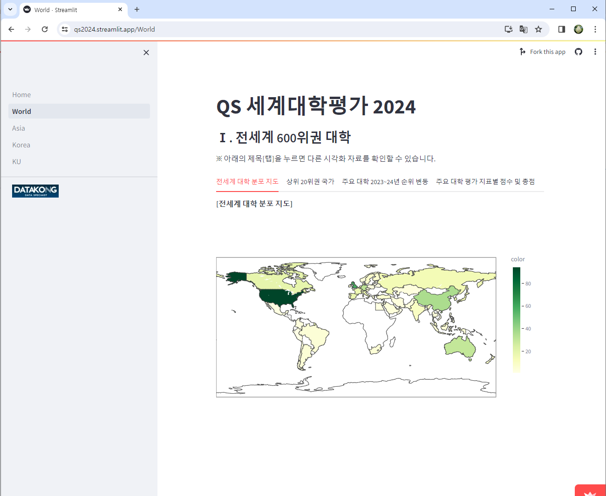
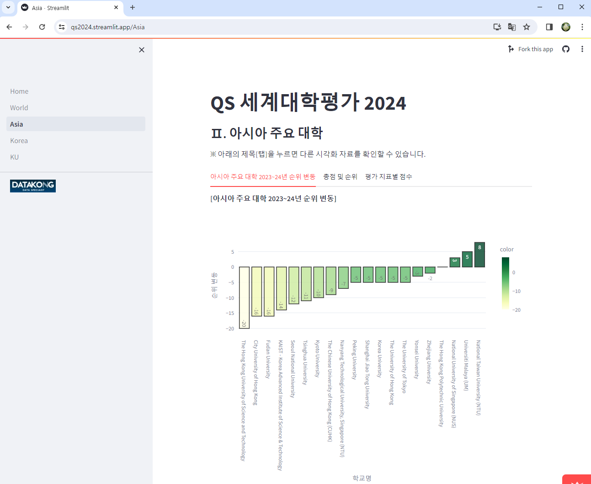
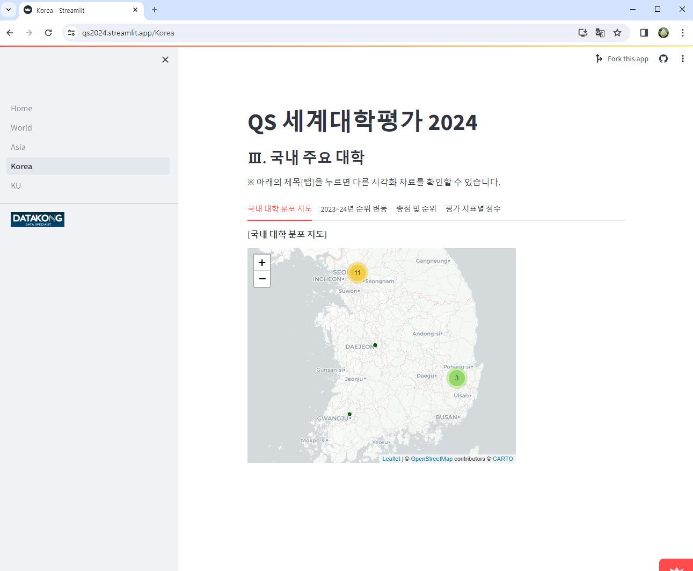
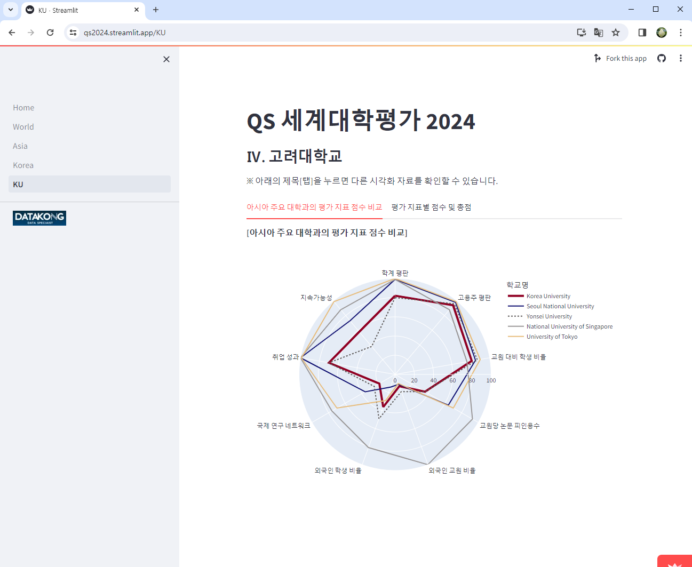

## [8th 프로젝트]: QS 세계대학평가 시각화 및 배포

- 작성: 2024년 1월 8일
- 사이트 바로가기: [qs2024.streamlit.app](https://qs2024.streamlit.app/) 
  
  
### 프로젝트 개요

1. 주제 및 데이터 소개: **QS 세계대학평가 2024년 결과 시각화** 
    - 세계대학평가 
        - 대학의 역량을 세계 주요 대학들과의 비교적인 관점에서 확인 가능 
        - 정부의 주요 사업인 4단계 두뇌한국21(BK21) 등에서 주요 평가 지표로 활용 
        - 대학의 발전 방향 모색에 활용 
        - 국제적인 교류가 늘어나는 상황에서 대학 및 대학원 진학자에 정보 제공 

    - **QS(Quacquarelli Symonds) 세계대학평가**
        - 가장 영향력있는 평가
        - 분석 데이터: 가장 최신 데이터인 [2024년 자료](https://www.topuniversities.com/world-university-rankings) 
        - 분석 대상: 평가 지표별 점수를 모두 확인할 수 있는 전세계 상위 567개 대학    
  
2. 데이터 처리 및 시각화   
  
    - 시각화 구조: 전세계 → 아시아권 → 국내 대학 분포 순으로 구성 
        - [World](https://qs2024.streamlit.app/World) : 전세계 600위권 주요 대학 분포
        - [Asia](https://qs2024.streamlit.app/Asia) : 아시아권 주요 대학 분포
        - [Korea](https://qs2024.streamlit.app/Korea) : 국내 주요 대학 분포
        - [KU](https://qs2024.streamlit.app/KU) : 고려대와 아시아 주요 대학 평가 지표별 점수 비교

    - 데이터 처리 및 분석: Pandas 라이브러리 활용 
    - 데이터 시각화: Plotly 라이브러리 활용 
  
3. 웹 배포   
   
    - 웹 배포: Streamlit 라이브러리 활용
    - 사이트 바로가기: [qs2024.streamlit.app](https://qs2024.streamlit.app/) 
   

    

    

    

  
  
